# <p align="center"> CAPSTONE PROJECT
</p>

# <p align="center"> Healthcare Dataset Analysis: An Application of SQL Server and Tableau
</p>

<p align="center"> <strong>Author:</strong> Phan Anh Hoang
</p>

<p align="justify"> <strong>Summary:</strong> The goal of this project is to apply data querying methods using SQL Server and data visualization with Tableau in healthcare data analysis. The project emphasized the collection, cleaning, validation, and thorough analysis of data and the creation of detailed reports, which provided insights for stakeholders’ decision-making.<br>
<strong><em>Keywords:</em></strong> Healthcare, SQL Server, Tableau, Data Cleaning, Data Analysis, Insights
</p>

## Table of Contents
- **[1. Introduction](#1-introduction)**
- **[2. Methodology and Data](#2-methodology-and-data)**
- **[3. Data Cleansing and Preparation (Using SQL Server)](#3-data-cleansing-and-preparation-using-sql-server)**
- **[4. Data Analysis and Visualization: Answer Questions](#4-data-analysis-and-visualization-answer-questions)**
- **[5. Key Insights](#5-key-insights)**


## 1. Introduction
### 1.1 Background

<p align="justify">This project focused on analyzing healthcare data from 55,500 anonymized patient records from 10 major hospitals across the United States. This fictional dataset provides an overview of hospital admissions, medical conditions, medications, insurance providers, and treatment costs.

<p align="justify">The goal of the project was to gain a better understanding of patient demographics (age, gender, and blood type) to identify which groups are most frequently hospitalized. It also aimed to determine the most common conditions within specific patient groups, analyze treatment costs, lengths of stay, and types of admissions, and track medication and insurance outcomes. The results of this analysis will support stakeholders (such as data analysts, healthcare strategists, hospital administrators, and public health researchers) in making strategic decisions to optimize healthcare service delivery.


### 1.2 Business Task
<p align="justify"> <strong>Scenario:</strong> You are a data analyst at a national healthcare monitoring organization. You have been granted access to a dataset of 55,500 individual patient records from 10 major hospitals across the United States. This dataset captures an overview of hospital admissions, medical conditions, medications, insurance providers, and treatment costs. Your goal is to tell the story of patient care at these hospitals, identify trends, and help stakeholders make data-driven decisions.

<p align="justify">The key questions to answer in the analysis, as requested by stakeholders (questions developed from the dataset documentation), include:</p>

-	*What are the most common age groups, genders, and blood types among patients? Are certain patient groups admitted more frequently than others?*
-	*Which medical conditions are most frequently diagnosed, and do they disproportionately affect certain demographic groups?*
-	*How long do patients typically stay in the hospital for different conditions? Does this length of stay vary by hospital or by type of admission (emergency, urgent, or planned)?*
-	*What are the typical treatment costs for each condition? Are there significant cost differences between hospitals or insurance providers?*
-	*Which hospitals treat the largest number of patients, and how do they compare in terms of treatment outcomes (e.g., test results)?*
-	*Which medications are most commonly prescribed for each condition? Are they used consistently across hospitals?*
-	*How are patients admitted — mostly through emergency, urgent, or planned admissions — and how does admission type impact length of stay and treatment costs?*
-	*Which insurance companies cover the most patients, and how does this relate to treatment costs and patient outcomes?*
-	*Where are the hospitals located, and are there regional differences in patient health profiles, quality of care, or billing amounts?*

## 2. Methodology and Data
### 2.1 Approach
#### *2.1.1 Research Process*

<p align="justify">This project follows the steps of the data analysis process from the Google Data Analytics Professional Certificate, which include <strong>ask, prepare, process, analyze, share, and act.</strong> These steps are presented in the five main parts of the project:</p>

1. **Introduction:** Ask
2. **Methodology and Data:** Prepare
3. **Data Cleaning and Preparation:** Process
4. **Data Analysis and Visualization:** Analyze
5. **Key Insights:** Share and Act

#### *2.1.2 Data Analysis Method*

In this project, I used **descriptive analytics** as the primary approach to explore and understand the overall characteristics of the healthcare dataset. 

Since the dataset is synthetic and does not represent real-world medical or operational dynamics, applying predictive or diagnostic analytics would have likely generated patterns that are not clinically or operationally meaningful. In addition, the role of this project is to demonstrate the analytical capabilities of a **data analyst**, focusing on data preparation, exploration, and visualization — rather than providing medical interpretation or domain-specific modeling. Concentrating on descriptive analysis ensures a thorough, transparent, and technically sound exploration of the data within the scope of this capstone project.

The goal of this approach was to describe, summarize, and visualize the key features of the hospital data. This will help stakeholders understand who the primary patients are, which conditions are most common, and the length of hospital stays and treatment outcomes across different healthcare facilities. From there, it provides a foundation for more advanced analyses later on, such as diagnostic or predictive analytics.

#### *2.1.3 Tools and Software*

The main tools used in the project included:
- **SQL Server (MS SQL):** Techniques used included connecting to the database via Azure Data Studio; basic queries (`WHERE`, logical operators, arithmetic operators); data aggregation with `GROUP BY`, `HAVING`, `CASE WHEN`, and numeric, string, and date functions; querying data from multiple tables with `JOIN`; and working with subqueries, Common Table Expressions (`CTEs`), and views to optimize queries.
- **Tableau:** Techniques include building advanced chart types such as pie charts, bar charts, area charts,  scatter charts, table, 100% stacked column charts, map, and, line and clustered column charts.

### 2.2 Data Source 

This dataset provided detailed insight into hospital operations and patient demographics at major hospitals in the United States. It included records of admissions, diagnoses, treatments, and associated costs, offering a means to explore insights that can enhance healthcare decision-making, optimize costs, and improve patient outcomes.

This dataset is synthetic, generated for a public analytics challenge (Onyx DataDNA, April 2025). It does not represent real patients or actual hospital operations. While the data structure and variables are realistic, the patterns and distributions are simulated. As a result, some findings may not reflect real-world medical or operational dynamics. Any insights should be interpreted as analytical demonstrations rather than operational recommendations.

The dataset and business questions were taken from the Onyx Data *DataDNA April 2025 Dataset Challenge*, available [here]([https://](https://onyxdata.kit.com/datadna-apr-2025)).

## 3. Data Cleansing and Preparation (Using SQL Server)
### 3.1 Import Data
After downloading and extracting the data file, I connected the `.csv` file to the database using Azure Data Studio. I named the table and selected the default schema as dbo. I then renamed the columns to speed up queries, chose appropriate data types for each column, and defined the primary key column. The data was successfully inserted into the table.
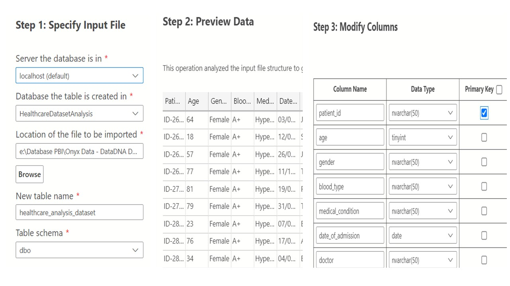


### 3.2 Data Structure and Field Description
In this step, I listed the table’s columns and data attributes, especially those that are required, to identify which data fields needed to be checked. The SQL query below retrieved the schema of the `healthcare_analysis` table:

``` sql
-- View structure of table healthcare_analysis
SELECT
    COLUMN_NAME,
    DATA_TYPE,
    CHARACTER_MAXIMUM_LENGTH,
    IS_NULLABLE
FROM INFORMATION_SCHEMA.COLUMNS
WHERE TABLE_NAME = 'healthcare_analysis'
ORDER BY ORDINAL_POSITION;
```
<table style="border-collapse: collapse; width: 100%;">
  <thead>
    <tr>
      <th style="border: 1px solid #ccc; padding: 6px;">Table</th>
      <th>Column Name</th>
      <th>Data Type</th>
      <th>Sample Values</th>
      <th>Column Description</th>
    </tr>
  </thead>
  <tbody>
    <tr>
      <td rowspan="17" style="border: 1px solid #ccc; text-align:center;"><strong>healthcare_analysis</strong></td>
      <td>patient_id</td>
      <td>nvarchar</td>
      <td>ID-0001, ID-0002, ID-0003,…</td>
      <td>Unique identifier for each patient</td>
    </tr>
    <tr>
      <td>age</td>
      <td>tinyint</td>
      <td>59, 84, 70,…</td>
      <td>Age of the patient (in years)</td>
    </tr>
    <tr>
      <td>gender</td>
      <td>nvarchar</td>
      <td>Female, Male, Non-binary</td>
      <td>Gender of the patient</td>
    </tr>
    <tr>
      <td>blood_type</td>
      <td>nvarchar</td>
      <td>O+, A+, B+,…</td>
      <td>Blood group of the patient</td>
    </tr>
    <tr>
      <td>medical_condition</td>
      <td>nvarchar</td>
      <td>Diabetes, Hypertension, Obesity</td>
      <td>Primary medical condition diagnosed</td>
    </tr>
    <tr>
      <td>date_of_admission</td>
      <td>date</td>
      <td>2021-05-06, 2023-11-28, 2023-10-08</td>
      <td>Date when the patient was admitted to the hospital</td>
    </tr>
    <tr>
      <td>doctor</td>
      <td>nvarchar</td>
      <td>Tammy Wilson, Yvonne Harper, Theresa Howard</td>
      <td>Responsible doctor during the stay</td>
    </tr>
    <tr>
      <td>hospital</td>
      <td>nvarchar</td>
      <td>Houston Methodist Hospital, NewYork-Presbyterian Hospital, UCSF Medical Center</td>
      <td>Name of the hospital where the patient received treatment</td>
    </tr>
    <tr>
      <td>insurance_provider</td>
      <td>nvarchar</td>
      <td>UnitedHealthCare, Medicare, Cigna</td>
      <td>Name of the patient's insurance company</td>
    </tr>
    <tr>
      <td>billing_amount</td>
      <td>float</td>
      <td>35072.8, 37338.9, 24189.3</td>
      <td>Total billing amount for the treatment (in USD)</td>
    </tr>
    <tr>
      <td>room_number</td>
      <td>smallint</td>
      <td>160, 387, 126</td>
      <td>Room number assigned to the patient</td>
    </tr>
    <tr>
      <td>admission_type</td>
      <td>nvarchar</td>
      <td>Elective, Emergency, Urgent</td>
      <td>Type of admission</td>
    </tr>
    <tr>
      <td>discharge_date</td>
      <td>date</td>
      <td>2022-11-05, 2021-03-25, 2023-06-02</td>
      <td>Date when the patient was discharged</td>
    </tr>
    <tr>
      <td>medication</td>
      <td>nvarchar</td>
      <td>Penicillin, Aspirin, Ibuprofen</td>
      <td>General medication prescribed</td>
    </tr>
    <tr>
      <td>test_results</td>
      <td>nvarchar</td>
      <td>Abnormal, Inconclusive, Normal</td>
      <td>Outcome of medical tests</td>
    </tr>
    <tr>
      <td>hospital_latitude</td>
      <td>float</td>
      <td>42.3624, 41.5032, 29.7095</td>
      <td>Geographical latitude of the hospital</td>
    </tr>
    <tr>
      <td>hospital_longitude</td>
      <td>float</td>
      <td>-95.3986, -118.381, -92.4674</td>
      <td>Geographical longitude of the hospital</td>
    </tr>
  </tbody>
</table>

### 3.3 Handling Missing Data
In this section, I assessed the completeness of the data and identified missing values in each column. The query used the aggregate `COUNT()` function with `CASE WHEN ... THEN `clauses to count `NULL` values in each field, and compares the result with the original total record count to ensure no data was lost during import. This step helped confirm the integrity and reliability of the dataset before deeper analysis.

#### *3.3.1 Data Overview*
``` sql
SELECT COUNT(*) AS total_records FROM healthcare_analysis;
```
| total_records |
| ------------- |
| 55500         |

***Result:*** The dataset had 55,500 rows.
Comparing the total number of records in the dataset with the count from the original source data showed that no data was lost during extraction.

#### *3.3.2 Checking for NULL Values in Each Column*

``` sql
SELECT
    COUNT(CASE WHEN patient_id IS NULL THEN 1 END) AS n1,
    COUNT(CASE WHEN age IS NULL THEN 1 END) AS n2,
    COUNT(CASE WHEN gender IS NULL THEN 1 END) AS n3,
    COUNT(CASE WHEN blood_type IS NULL THEN 1 END) AS n4,
    COUNT(CASE WHEN medical_condition IS NULL THEN 1 END) AS n5,
    COUNT(CASE WHEN date_of_admission IS NULL THEN 1 END) AS n6,
    COUNT(CASE WHEN doctor IS NULL THEN 1 END) AS n7,
    COUNT(CASE WHEN hospital IS NULL THEN 1 END) AS n8,
    COUNT(CASE WHEN insurance_provider IS NULL THEN 1 END) AS n9,
    COUNT(CASE WHEN billing_amount IS NULL THEN 1 END) AS n10,
    COUNT(CASE WHEN room_number IS NULL THEN 1 END) AS n11,
    COUNT(CASE WHEN admission_type IS NULL THEN 1 END) AS n12,
    COUNT(CASE WHEN discharge_date IS NULL THEN 1 END) AS n13,
    COUNT(CASE WHEN medication IS NULL THEN 1 END) AS n14,
    COUNT(CASE WHEN test_results IS NULL THEN 1 END) AS n15,
    COUNT(CASE WHEN hospital_latitude IS NULL THEN 1 END) AS n16,
    COUNT(CASE WHEN hospital_longitude IS NULL THEN 1 END) AS n17
FROM healthcare_analysis;
```
| n1  | n2  | n3  | n4  | n5  | n6  | n7  | n8  | n9  | n10 | n11 | n12 | n13 | n14 | n15 | n16 | n17 |
| --- | --- | --- | --- | --- | --- | --- | --- | --- | --- | --- | --- | --- | --- | --- | --- | --- |
| 0   | 0   | 0   | 0   | 0   | 0   | 0   | 0   | 0   | 0   | 0   | 0   | 0   | 0   | 0   | 0   | 0   |

***Result:*** The query showed that there were no `NULL` values in any column.

### 3.4 Remove Duplicate or Irrelevant Observations
The goal of this section was to remove duplicate records to ensure each patient appears only once. The main technique involved using `GROUP BY` ... `HAVING COUNT(*) > 1` to detect duplicates and `ROW_NUMBER() OVER (PARTITION BY ...)` to identify redundant records to delete. Removing duplicate data helps improve the accuracy of statistics and subsequent analyses.

``` sql
-- Check duplicates
SELECT  
    patient_id,
    COUNT(*) AS Occurrences
FROM healthcare_analysis
GROUP BY patient_id
HAVING COUNT(*) > 1;
-- Backup data
SELECT * INTO healthcare_analysis_backup FROM healthcare_analysis;

-- Delete duplicates if any
WITH DuplicateRecords AS (
    SELECT *, 
           ROW_NUMBER() OVER (PARTITION BY patient_id ORDER BY (SELECT NULL)) AS rn
    FROM healthcare_analysis
)
DELETE FROM DuplicateRecords
WHERE rn > 1;
```

|patient_id|Occurrences|
|---|---|

***Result:*** The query shows that there were no duplicate records.

### 3.5 Fix Structural Errors
This section focused on normalizing the data by validating categorical values such as gender, blood type, admission type, and insurance provider. Queries used `SELECT DISTINCT` to detect formatting errors and logical conditions to check for invalid values (such as negative age or discharge dates earlier than admission dates). This ensured the data was consistent and accurately reflects reality.
``` sql
-- Check distinct values for important columns
-- Gender
SELECT DISTINCT gender FROM healthcare_analysis ORDER BY gender;

-- Blood Type
SELECT DISTINCT blood_type FROM healthcare_analysis ORDER BY blood_type;

-- Medical Condition
SELECT DISTINCT medical_condition FROM healthcare_analysis ORDER BY medical_condition;

-- Admission Type
SELECT DISTINCT admission_type FROM healthcare_analysis ORDER BY admission_type;

-- Insurance Provider
SELECT DISTINCT insurance_provider FROM healthcare_analysis ORDER BY insurance_provider;

-- Hospital
SELECT DISTINCT hospital FROM healthcare_analysis ORDER BY hospital;

-- Test Results
SELECT DISTINCT test_results FROM healthcare_analysis ORDER BY test_results;

-- Medication
SELECT DISTINCT medication FROM healthcare_analysis ORDER BY medication;
```
| gender     | blood_type | medical_condition | admission_type | insurance_provider | hospital                       | test_results | medication  |
| ---------- | ---------- | ----------------- | -------------- | ------------------ | ------------------------------ | ------------ | ----------- |
| Female     | A-         | Arthritis         | Elective       | Aetna              | Cedars-Sinai Medical Center    | Abnormal     | Aspirin     |
| Male       | A+         | Asthma            | Emergency      | Cigna              | Cleveland Clinic               | Inconclusive | Ibuprofen   |
| Non-binary | AB-        | Cancer            | Urgent         | Medicare           | Houston Methodist Hospital     | Normal       | Lipitor     |
|            | AB+        | Diabetes          |                | UnitedHealthCare   | Johns Hopkins Hospital         |              | Paracetamol |
|            | B-         | Hypertension      |                |                    | Massachusetts General Hospital |              | Penicillin  |
|            | B+         | Obesity           |                |                    | Mayo Clinic                    |              |             |
|            | O-         |                   |                |                    | NewYork-Presbyterian Hospital  |              |             |
|            | O+         |                   |                |                    | Northwestern Memorial Hospital |              |             |
|            |            |                   |                |                    | UCLA Medical Center            |              |             |
|            |            |                   |                |                    | UCSF Medical Center            |              |             |

***Result*:** All columns had appropriate data structures.

``` sql
-- Check for invalid age values
SELECT *
FROM healthcare_analysis
WHERE age <= 0 OR age > 120;

-- Check that discharge_date is after or equal to date_of_admission
SELECT COUNT(*) AS invalid_date
FROM healthcare_analysis
WHERE discharge_date IS NULL
  AND date_of_admission >= discharge_date;
```

| invalid_age |
| ----------- |
| 0           |

| invalid_date |
| ------------ |
| 0            |

***Result*:** All age and date values were valid.

### 3.6 Handling Outliers
This step aimed to identify and handle outliers in the quantitative variable `billing_amount`, ensuring that values are not skewed. SQL was used to check for negative values and to apply statistical functions (`AVG()` and `STDEV()`) to find values exceeding three standard deviations from the mean. Removing these outliers helps improve the quality and reliability of cost analysis.
``` sql
SELECT COUNT(*) AS negative_billing_count
FROM healthcare_analysis
WHERE billing_amount < 0;
```

| negative_billing_count |
| ---------------------- |
| 108                    |

***Result:*** The query showed that 108 records had a negative `billing_amount`.

In the context of healthcare data, treatment costs cannot be negative (except in cases of refunds or special accounting entries), but this dataset does not include information about refunds.

***Solution:*** Removed the records with negative values, as they represent a very small proportion of the total sample.
``` sql
DELETE FROM healthcare_analysis
WHERE billing_amount < 0;
```

***Result:*** 108 records with negative cost were removed.

After this step, all `billing_amount` values are positive and valid. We then checked for any values exceeding three standard deviations from the mean:

``` sql
SELECT COUNT(*) AS billing_amount_outliers
FROM healthcare_analysis
WHERE billing_amount > (
    SELECT AVG(billing_amount) + 3 * STDEV(billing_amount) FROM healthcare_analysis
)
OR billing_amount < (
    SELECT AVG(billing_amount) - 3 * STDEV(billing_amount) FROM healthcare_analysis
);
```

| billing_amount_outliers |
| ----------------------- |
| 0                       |

***Result:*** No records with `billing_amount` beyond this threshold were found.

### 3.7 Data Integrity Checks and Constraints
The goal of this section was to strengthen data integrity by adding check constraints directly in the table. `ALTER TABLE` ... `ADD CONSTRAINT` statements were used to ensure that treatment costs are not negative and that discharge dates always occur on or after admission dates. This way, the data is protected from future input errors, maintaining long-term accuracy.

``` sql
-- Ensure billing_amount is not negative
ALTER TABLE healthcare_analysis
ADD CONSTRAINT CK_billing_amount_positive CHECK (billing_amount >= 0);

-- Ensure discharge_date is after or equal to date_of_admission
ALTER TABLE healthcare_analysis
ADD CONSTRAINT CK_discharge_after_admission CHECK (discharge_date >= date_of_admission);
```

### 3.8 Validate Data

After cleaning, this section helped verify the overall validity of the data by confirming that there were no missing values, duplicates, or logical errors. Descriptive statistics were summarized to ensure that the dataset accurately reflects reality: the number of medical records, the categories of diseases, hospitals, insurance providers, and prescribed medications. This is the final confirmation step before data exploration.
After the data cleaning process, the dataset was logically consistent, adhered to required fields, and was ready for in-depth analysis. The data showed: `55,392` unique patient records for the period `2019–2024`; `6` primary diagnosed medical conditions; `10` hospitals; `4` insurance companies covering patients; and `5` commonly prescribed medications.

### 3.9 Create Analytical View
This section built an aggregated view v_healthcare_analysis to prepare for analysis and visualization queries. The `CREATE OR ALTER VIEW` statement used date functions (`YEAR`, `EOMONTH`, `DATEPART`), `CASE WHEN`, and `DATEDIFF` to add calculated fields such as admission year, month-end, weekday and weekday name, weekend/weekday flag, length of stay, cost per day, and age group. This view helps standardize the data and improve efficiency for further analysis.

``` sql
-- Building View: dbo.v_healthcare_analysis with time dimension, length of stay, cost per day, and age group

GO
CREATE OR ALTER VIEW dbo.v_healthcare_analysis AS  
SELECT s.*,  
       YEAR([date_of_admission]) AS admission_year,
       EOMONTH([date_of_admission]) AS end_date_of_month,
       DATEPART(WEEKDAY, [date_of_admission]) AS [weekday],
       CASE DATEPART(WEEKDAY, [date_of_admission])  
           WHEN 1 THEN 'Sunday'  
           WHEN 2 THEN 'Monday'  
           WHEN 3 THEN 'Tuesday'  
           WHEN 4 THEN 'Wednesday'  
           WHEN 5 THEN 'Thursday'  
           WHEN 6 THEN 'Friday'  
           WHEN 7 THEN 'Saturday'  
       END AS [weekday_name], 
       CASE 
           WHEN DATEPART(WEEKDAY, [date_of_admission]) IN (1,7) THEN 'weekend'
           ELSE 'weekday'
       END AS weektype,
       DATEDIFF(day, date_of_admission, discharge_date) AS length_of_stay,
       ROUND(billing_amount * 1.0 / NULLIF(DATEDIFF(day, date_of_admission, discharge_date), 0), 2) AS cost_per_day,
       CASE 
           WHEN age >= 85 THEN '>=85'
           WHEN age >= 75 THEN '75-84'
           WHEN age >= 65 THEN '65-74'
           WHEN age >= 45 THEN '45-64'
           WHEN age >= 18 THEN '18-44'
           ELSE '<18'
       END AS age_group
FROM dbo.healthcare_analysis AS s;
GO
```

## 4. Data Analysis and Visualization: Answer Questions
After preparing the dataset for analysis and performing basic analysis using SQL, I used the cleaned data view `(v_healthcare_analysis)` to perform advanced data manipulation for filtering, sorting, and aggregate calculations. Then, Tableau was used to create charts that visualized trends and captured detailed insights.

### 4.1 Analysis of Patient Demographics
The SQL queries used `GROUP BY` to aggregate by age group, gender, and blood type; used `COUNT`, `CAST`, and division to calculate percentages; `ORDER BY` to rank groups; subqueries in `SELECT` to obtain the total number of patients; and a `CTE` with `ROW_NUMBER()` to identify the top patient groups by admission year.

***Answering:*** *What are the most common age groups, genders, and blood types among patients?*

``` sql
-- Analysis of patient demographics
-- Distribution by age group
SELECT age_group, COUNT(*) AS patients,
       CAST((100.0 * COUNT(*) / SUM(COUNT(*)) OVER()) AS DECIMAL(5,2)) AS pct_of_total
FROM v_healthcare_analysis
GROUP BY age_group
ORDER BY patients DESC;

-- Distribution by gender
SELECT gender, COUNT(*) AS patients,
       CAST((100.0 * COUNT(*) / SUM(COUNT(*)) OVER()) AS DECIMAL(5,2)) AS pct_of_total
FROM v_healthcare_analysis
GROUP BY gender
ORDER BY patients DESC;

-- Distribution by blood type
SELECT blood_type, COUNT(*) AS patients,
       CAST((100.0 * COUNT(*) / SUM(COUNT(*)) OVER()) AS DECIMAL(5,2)) AS pct_of_total
FROM v_healthcare_analysis
GROUP BY blood_type
ORDER BY patients DESC;
```

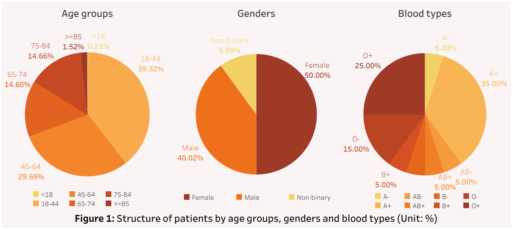

> ***Initial observations:*** 
>- *Age distribution:* The **18–44** age group was the largest, with 21,821 patients (39.32%), followed by the **45–64** age group (30%). The older age groups (65+) made up about 30% of admissions, while the under-18 group was almost negligible (~0.3%). Thus, most patients were working-age adults (**18–64** years old).
>- *Gender distribution:* **Females** were the majority with 27,750 patients (50%), about 10 percentage points higher than males. Non-binary individuals accounted for 10%, reflecting gender diversity in the dataset. Overall, females were the most common hospitalized group.
>- *Blood type distribution:* **A+** was the most common blood type with 19,425 patients (35%), followed by O+ (25%) and O– (15%). The remaining blood types were relatively rare (~5% each). Thus, **A+ and O+** dominated the patient population.

***Answering:*** *Are certain patient groups admitted more frequently than others?*


``` sql
-- Top 10 patient groups by admission frequency (age_group, gender, blood_type)
SELECT TOP(10)  
    age_group,
    gender,
    blood_type,
    COUNT(*) AS patients,
    CAST(100.0 * COUNT(*) / (SELECT COUNT(*) FROM v_healthcare_analysis) AS DECIMAL(5,2)) AS pct_of_total
FROM v_healthcare_analysis
GROUP BY age_group, gender, blood_type
ORDER BY patients DESC;

-- Top 10 patient groups by admission frequency by year
;WITH ranked AS (
    SELECT  
        admission_year,  
        age_group,
        gender,
        blood_type,
        COUNT(*) AS patients,
        CAST(100.0 * COUNT(*) / SUM(COUNT(*)) OVER (PARTITION BY admission_year) AS DECIMAL(5,2)) AS pct_of_total,
        ROW_NUMBER() OVER (PARTITION BY admission_year ORDER BY COUNT(*) DESC) AS rn
    FROM v_healthcare_analysis
    GROUP BY admission_year, age_group, gender, blood_type
)
SELECT  
    admission_year,
    age_group,
    gender,
    blood_type,
    patients,
    pct_of_total
FROM ranked
WHERE rn <= 10
ORDER BY admission_year, patients DESC;
```

<p align="center">
  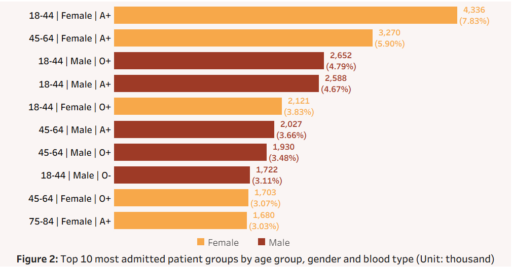
</p>
<p align="center">
  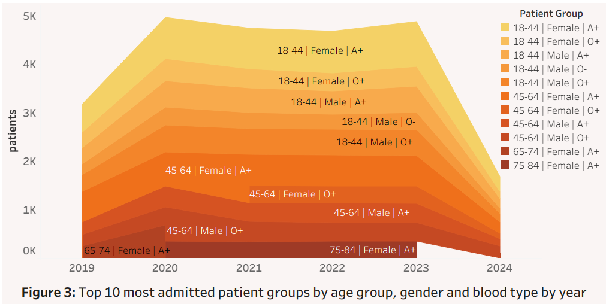
</p>

> ***Initial observations:*** 
> - The group of **18–44** year old females with blood type A+ was the most common (7.83% of patients). Overall, **female patients with blood type A+** in the **18–44** and **45–64** age ranges were the most frequently hospitalized groups. 
> - From **2019 to 2024**, these two groups consistently ranked in the top in terms of patient admissions. **Males** in the same age ranges had lower admission rates but still occupied high positions in the top 10. Therefore, **younger and middle-aged female patients** (especially those with blood type A+) were the most frequently admitted group.

### 4.2 Analysis of Common Medical Conditions and Distribution by Demographics
The SQL queries used `GROUP BY`, `COUNT`, and `SUM` to tally conditions; used `CASE WHEN` to calculate rates by demographic features; a `CTE` to break calculation steps; and joins to find the group with the highest count.

***Answering:*** *Which medical conditions are most frequently diagnosed, and do they disproportionately affect certain demographic groups?*
``` sql
-- Common medical conditions
SELECT  
    medical_condition,
    COUNT(*) AS patients,
    CAST(100.0 * COUNT(*) / (SELECT COUNT(*) FROM healthcare_analysis) AS DECIMAL(5,2)) AS pct_of_total
FROM healthcare_analysis
GROUP BY medical_condition
ORDER BY patients DESC;
```

<p align="center">
  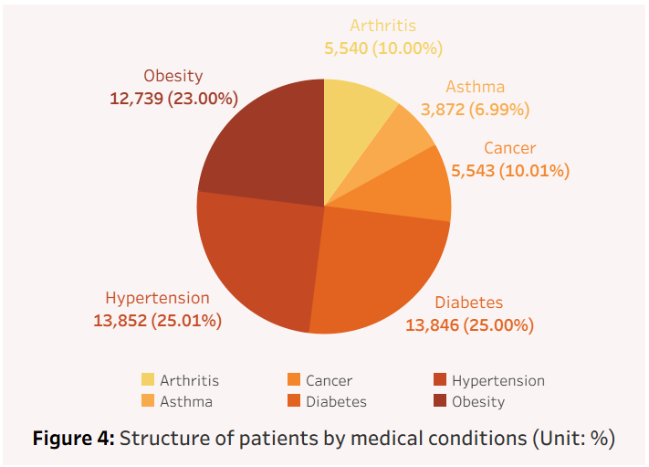
</p>


>***Initial observation:*** 
>- **Diabetes, Hypertension, and Obesity** were the three conditions with the highest number of diagnosed patients, accounted for more than **73%** of all cases in the dataset.

``` sql
-- Distribution of conditions by age group
;WITH age_group AS (
    SELECT  
        medical_condition,
        SUM(CASE WHEN age_group = '<18' THEN 1 ELSE 0 END) AS '<18',
        SUM(CASE WHEN age_group = '18-44' THEN 1 ELSE 0 END) AS '18-44',
        SUM(CASE WHEN age_group = '45-64' THEN 1 ELSE 0 END) AS '45-64',
        SUM(CASE WHEN age_group = '65-74' THEN 1 ELSE 0 END) AS '65-74',
        SUM(CASE WHEN age_group = '75-84' THEN 1 ELSE 0 END) AS '75-84',
        SUM(CASE WHEN age_group = '>=85' THEN 1 ELSE 0 END) AS '>=85',
        COUNT(*) AS total_patients
    FROM v_healthcare_analysis
    GROUP BY medical_condition
)
SELECT  
    medical_condition,
    CAST([<18] * 100.0 / total_patients AS DECIMAL(5,2)) AS '<18',
    CAST([18-44] * 100.0 / total_patients AS DECIMAL(5,2)) AS '18-44',
    CAST([45-64] * 100.0 / total_patients AS DECIMAL(5,2)) AS '45-64',
    CAST([65-74] * 100.0 / total_patients AS DECIMAL(5,2)) AS '65-74',
    CAST([75-84] * 100.0 / total_patients AS DECIMAL(5,2)) AS '75-84',
    CAST([>=85] * 100.0 / total_patients AS DECIMAL(5,2)) AS '>=85'
FROM age_group
ORDER BY medical_condition;

-- Distribution of conditions by gender
;WITH gender AS (
    SELECT  
        medical_condition,
        SUM(CASE WHEN gender = 'Female' THEN 1 ELSE 0 END) AS female,
        SUM(CASE WHEN gender = 'Male' THEN 1 ELSE 0 END) AS male,
        SUM(CASE WHEN gender = 'Non-binary' THEN 1 ELSE 0 END) AS non_binary,
        COUNT(*) AS total_patients
    FROM v_healthcare_analysis
    GROUP BY medical_condition
)
SELECT  
    medical_condition,
    CAST(female * 100.0 / total_patients AS DECIMAL(5,2)) AS female,
    CAST(male * 100.0 / total_patients AS DECIMAL(5,2)) AS male,
    CAST(non_binary * 100.0 / total_patients AS DECIMAL(5,2)) AS non_binary
FROM gender
ORDER BY medical_condition;

-- Distribution of conditions by blood type
;WITH blood_type AS (
    SELECT  
        medical_condition,
        SUM(CASE WHEN blood_type = 'A-' THEN 1 ELSE 0 END) AS 'A-',
        SUM(CASE WHEN blood_type = 'A+' THEN 1 ELSE 0 END) AS 'A+',
        SUM(CASE WHEN blood_type = 'AB-' THEN 1 ELSE 0 END) AS 'AB-',
        SUM(CASE WHEN blood_type = 'AB+' THEN 1 ELSE 0 END) AS 'AB+',
        SUM(CASE WHEN blood_type = 'B-' THEN 1 ELSE 0 END) AS 'B-',
        SUM(CASE WHEN blood_type = 'B+' THEN 1 ELSE 0 END) AS 'B+',
        SUM(CASE WHEN blood_type = 'O-' THEN 1 ELSE 0 END) AS 'O-',
        SUM(CASE WHEN blood_type = 'O+' THEN 1 ELSE 0 END) AS 'O+',
        COUNT(*) AS total_patients
    FROM v_healthcare_analysis
    GROUP BY medical_condition
)
SELECT  
    medical_condition,
    CAST([A-] * 100.0 / total_patients AS DECIMAL(5,2)) AS 'A-',
    CAST([A+] * 100.0 / total_patients AS DECIMAL(5,2)) AS 'A+',
    CAST([AB-] * 100.0 / total_patients AS DECIMAL(5,2)) AS 'AB-',
    CAST([AB+] * 100.0 / total_patients AS DECIMAL(5,2)) AS 'AB+',
    CAST([B-] * 100.0 / total_patients AS DECIMAL(5,2)) AS 'B-',
    CAST([B+] * 100.0 / total_patients AS DECIMAL(5,2)) AS 'B+',
    CAST([O-] * 100.0 / total_patients AS DECIMAL(5,2)) AS 'O-',
    CAST([O+] * 100.0 / total_patients AS DECIMAL(5,2)) AS 'O+'
FROM blood_type
ORDER BY medical_condition;
```
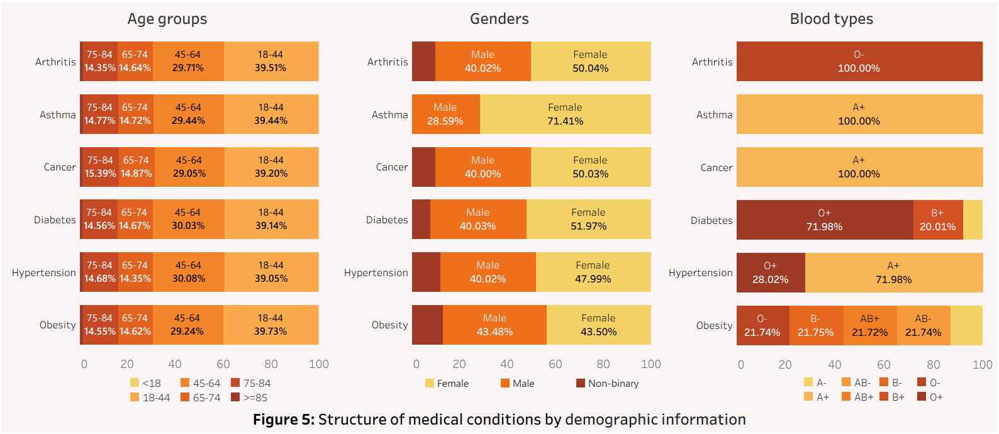

> ***Initial observations:***
>- The age distribution of conditions showed that the most common conditions primarily occurred in the **18–44** (≈39%) and **45–64** (≈30%) age groups. The **65+** groups accounted for around 29–31%. The **under-18** group had a very small share (~0.2%). Chronic conditions (Hypertension, Diabetes, Obesity) mainly occurred in young and middle-aged adults (18–64). 
>- In terms of gender distribution, **females** predominated in most conditions, especially Asthma and Arthritis. Males had relatively balanced proportions in Diabetes and Hypertension. The non-binary group had a significantly higher proportion in Obesity and Hypertension. 
>- For blood type, **Arthritis** patients were entirely in blood type **O–**. Conditions like **Asthma, Cancer, and Hypertension** had patient populations concentrated in **A+**, while **Diabetes** was mainly in **O+**. **Obesity** was present across most blood types (notably absent in **A+, B+, O+**).

``` sql
-- Distribution by age, gender, and blood type together
;WITH m1 AS (
    SELECT medical_condition, age_group, gender, blood_type, COUNT(*) AS patients
    FROM v_healthcare_analysis
    GROUP BY medical_condition, age_group, gender, blood_type
), m2 AS (
    SELECT medical_condition, MAX(patients) AS max_patient
    FROM m1
    GROUP BY medical_condition
)
SELECT m1.medical_condition, m1.age_group, m1.gender, m1.blood_type, m2.max_patient
FROM m1
JOIN m2 ON m1.medical_condition = m2.medical_condition AND m1.patients = m2.max_patient
ORDER BY medical_condition, max_patient DESC;
```

<p align="center">
  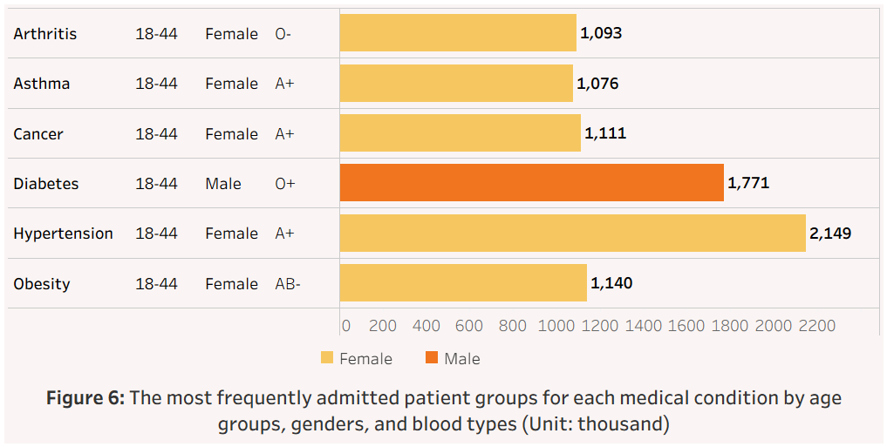
</p>


> ***Initial observations:*** 
>- The combined distribution by age, gender, and blood type showed that for every condition, the **18–44** age group had the highest patient count. 
>- **Female** patients with blood type **A+** dominated many conditions (Hypertension, Asthma, Cancer). 
>- **Male** patients with blood type **O+** dominated in **Diabetes**.

### 4.3 Analysis of Hospital Stay by Condition, Hospital, and Admission Type
The SQL queries used window functions (`AVG` ... `OVER`, `PERCENTILE_CONT`) to compute averages and percentiles; `GROUP BY`to compare by hospital or admission type; `ORDER BY` to find the groups with the longest stays; and arithmetic to normalize results.

***Answering:*** *How long do patients typically stay in the hospital for different conditions? Does this length of stay vary by hospital or by type of admission (emergency, urgent, or planned)?*

``` sql
-- Length of stay by medical condition
SELECT DISTINCT medical_condition,
       ROUND(AVG(CAST(length_of_stay AS FLOAT)) OVER (PARTITION BY medical_condition), 2) AS avg_los,
       PERCENTILE_CONT(0.5) WITHIN GROUP (ORDER BY length_of_stay) OVER (PARTITION BY medical_condition) AS median_los,
       PERCENTILE_CONT(0.9) WITHIN GROUP (ORDER BY length_of_stay) OVER (PARTITION BY medical_condition) AS p90_los,
       COUNT(*) OVER (PARTITION BY medical_condition) AS cases
FROM v_healthcare_analysis
ORDER BY avg_los DESC;
```

<p align="center">
  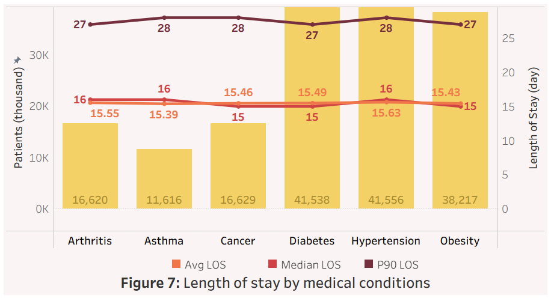
</p>

> ***Initial observation*:** 
> - The average hospital length of stay was **fairly consistent** across conditions. 
> - Patients stayed an average **15.4 to 15.6 days**. No single condition showed a significantly longer stay, though **Hypertension and Arthritis** were slightly higher. 
> - The 90th percentile of length of stay indicated that the most severe 10% of cases extend over **27–28 days**.

``` sql
-- Length of stay by hospital
SELECT medical_condition,
       hospital,
       ROUND(AVG(CAST(length_of_stay AS FLOAT)), 2) AS avg_los,
       COUNT(*) AS total_cases
FROM v_healthcare_analysis
GROUP BY medical_condition, hospital
ORDER BY medical_condition, avg_los DESC;
-- Length of stay by admission type
SELECT medical_condition,
       admission_type,
       ROUND(AVG(CAST(length_of_stay AS FLOAT)), 2) AS avg_los,
       COUNT(*) AS total_cases
FROM v_healthcare_analysis
GROUP BY medical_condition, admission_type
ORDER BY medical_condition, avg_los DESC;
```

<p align="center">
  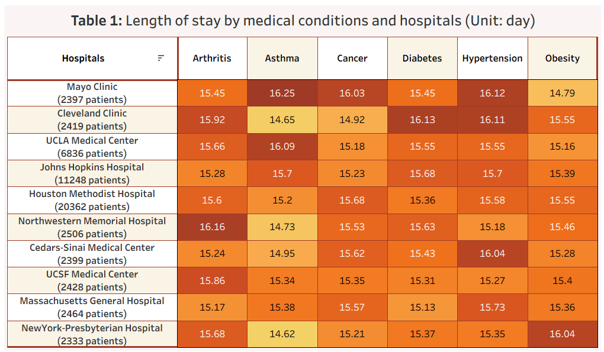
</p>


> ***Initial observation:***
>- *Across hospitals*, the average length of stay ranges from about **14.6 to 16.2 days**. For the same condition, the difference between hospitals is about **1.0–1.3 days**. 
>- **Mayo Clinic** tended to have higher-than-average stays (≈16.0 days) for most conditions. **Houston Methodist and Johns Hopkins** had the largest numbers of cases, with more stable stays (≈15.3–15.6 days). 
>- **Asthma** had slightly lower stays at some hospitals (≈14.6–16.3 days).

<p align="center">
  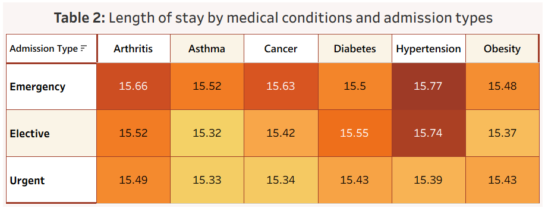
</p>

> ***Initial observation:***
>- *Regarding admission type*, **Emergency** admissions generally had the highest average stays (**15.5–15.8 days**), **elective** slightly lower (**15.3–15.7**), and **urgent** similar or slightly lower than elective (**15.3–15.5**). 
>- For example, for **Hypertension**: Emergency 15.77 days (vs. 15.39 urgent); for **Cancer**: Emergency 15.63 vs. Elective 15.42; for **Asthma and Obesity**, differences are minimal (~0.1–0.2 days). 
>- Thus, **emergency** admissions tended to stay **a bit longer** (0.2–0.3 days) than other types, but overall differences were small, indicating treatment durations were fairly consistent across admission types.

### 4.4 Analysis of Treatment Costs by Condition and Hospital
The SQL queries applied window functions (`AVG` ... `OVER`, `PERCENTILE_CONT`, `STDEV`, `MIN`, `MAX`) to describe costs; `GROUP BY` to compare across hospitals; `ORDER BY` to identify highest costs; and arithmetic to normalize the data.

***Answering:*** *What are the typical treatment costs for each condition? Are there significant cost differences between hospitals or insurance providers?*

``` sql
-- Average cost by medical condition (mean, median, sd, min, max)
SELECT DISTINCT medical_condition,
       ROUND(AVG(billing_amount) OVER (PARTITION BY medical_condition), 2) AS avg_bill,
       ROUND(PERCENTILE_CONT(0.5) WITHIN GROUP (ORDER BY billing_amount) OVER (PARTITION BY medical_condition), 2) AS median_bill,
       ROUND(STDEV(billing_amount) OVER (PARTITION BY medical_condition), 2) AS sd_bill,
       ROUND(MIN(billing_amount) OVER (PARTITION BY medical_condition), 2) AS min_bill,
       ROUND(MAX(billing_amount) OVER (PARTITION BY medical_condition), 2) AS max_bill,
       COUNT(*) OVER (PARTITION BY medical_condition) AS cases
FROM v_healthcare_analysis
ORDER BY avg_bill DESC;
```

<p align="center">
  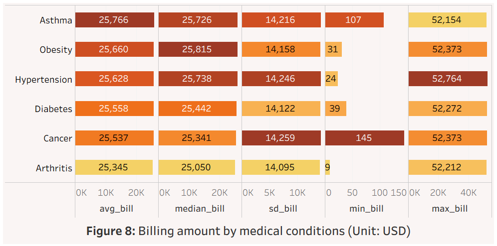
</p>

> ***Initial observations:*** 
>- The average treatment cost for each condition was quite uniform, around **\$25,300–\$25,800**, with no large differences between condition groups. 
>- Although the mean and median were very close, the high standard deviation (**~$14,000**) indicated substantial variability among cases or between hospitals. 

``` sql
-- Cost by hospital and condition 
SELECT hospital, medical_condition,
       ROUND(AVG(billing_amount), 2) AS avg_bill,
       COUNT(*) AS patients
FROM v_healthcare_analysis
GROUP BY hospital, medical_condition
ORDER BY medical_condition ASC, avg_bill DESC;
```

<p align="center">
  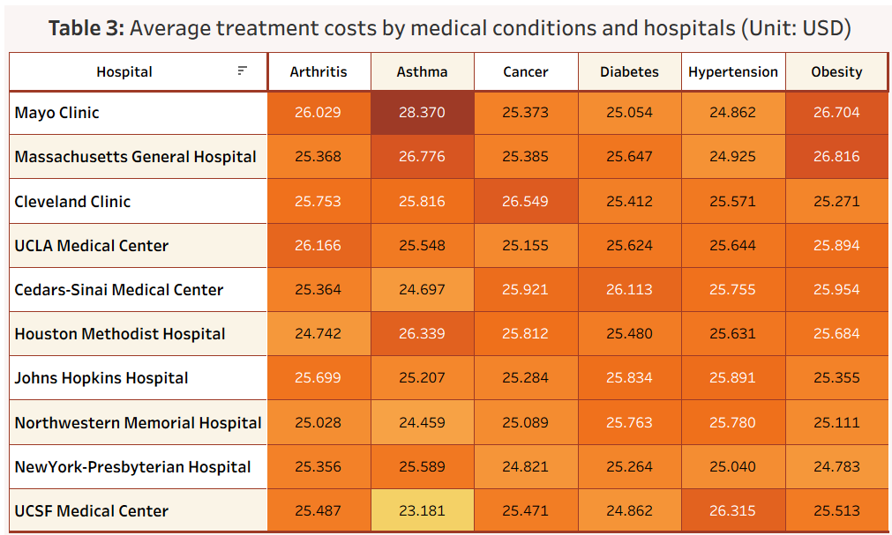
</p>

> ***Initial observation:*** 
>- Looking at cost differences between hospitals, generally the costs across conditions and hospitals seemed similar (**\$24,000–\$28,000**), but there were notable exceptions. Asthma had the greatest cost variation: **Mayo Clinic** had the **highest** asthma treatment cost at \$28,370, while **UCSF Medical Center** had the **lowest** at \$23,181 (a difference of over \$5,000). **Cancer** had the most uniform costs. Cancer costs varied the least across hospitals, ranging from **\$24,821 to \$25,659** — a difference of about **\$800.**
>- **High-Cost Hospitals:** Mayo Clinic tended to have the highest pricing overall, leading in costs for Asthma and Obesity. UCLA Medical Center was also in the high-cost group, topping costs for Arthritis. **Hospitals with Polarized Costs:** UCSF Medical Center was a clear example: it had the lowest costs for Asthma and Diabetes, but the highest for Hypertension. **Lower-Cost Hospitals:** NewYork-Presbyterian Hospital reported the lowest costs for Cancer and Obesity.

### 4.5. Analysis of patient count and treatment outcomes
The SQL queries used `GROUP BY` to aggregate by hospital; `CASE WHEN` + `SUM` to count cases by test result category; arithmetic operators to calculate percentages; and `ORDER BY` to identify the largest hospitals and compare treatment quality.

***Answering:*** *Which hospitals treat the largest number of patients, and how do they compare in terms of treatment outcomes (e.g., test results)?*
``` sql
-- Test results distribution by hospital
SELECT  
    hospital, 
    COUNT(*) AS patients, 
    CAST(100.0 * SUM(CASE WHEN test_results = 'Normal' THEN 1 ELSE 0 END) / 
    NULLIF(COUNT(*),0) AS decimal(5,2)) AS pct_normal, 
    CAST(100.0 * SUM(CASE WHEN test_results = 'Abnormal' THEN 1 ELSE 0 END) / 
    NULLIF(COUNT(*),0) AS decimal(5,2)) AS pct_abnormal, 
    CAST(100.0 * SUM(CASE WHEN test_results = 'Inconclusive' THEN 1 ELSE 0 END) / 
    NULLIF(COUNT(*),0) AS decimal(5,2)) AS pct_inconclusive 
FROM v_healthcare_analysis 
GROUP BY hospital 
ORDER BY patients DESC;
```
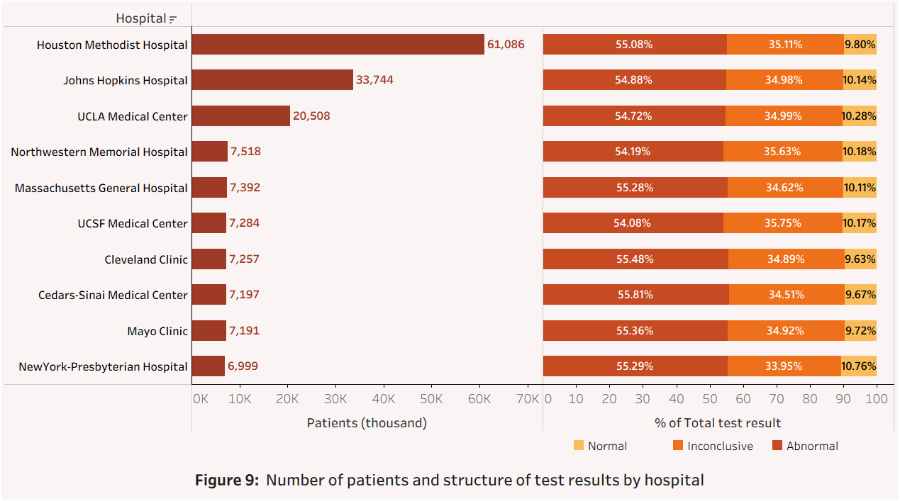

> ***Initial observation:***
>- Top hospitals by patient volume: **Houston Methodist Hospital** led with 20,362 patients, nearly double **Johns Hopkins Hospital** (11,248) and nearly triple **UCLA Medical Center** (6,836). These three hospitals accounted for the largest share of patients in the system. Next was a **group of similarly sized hospitals**, each with roughly **6,900 to 7,500** patients.
>- Comparing **test results** (an indicator of treatment quality): Although Houston Methodist treated more than twice as many patients as Johns Hopkins and three times as many as UCLA, their distributions of test results were **nearly identical**. The percentage of **Normal** results was about **9.6–10.8%** across hospitals, almost the same for all. **Abnormal results** accounted for about **54–56%**, highest at Cedars-Sinai Medical Center (55.81%), Cleveland Clinic (55.48%), and Houston Methodist (55.08%). **A minor difference** is that **NewYork-Presbyterian Hospital** had the **highest Normal rate (10.76%)** and the lowest Inconclusive rate (33.95%), making it the hospital closest to the overall trend.

### 4.6. Analysis of most frequently prescribed medications by condition
The SQL queries used `GROUP BY` to aggregate by medication; the window function `PARTITION BY` to calculate proportions within each condition; a `CTE` (common table expression) to prepare intermediate data; `MIN`/`MAX` + arithmetic to measure differences in prescription proportions; and CASE WHEN to classify consistency levels.

***Answering:*** *Which medications are most commonly prescribed for each condition? Are they used consistently across hospitals?*

``` sql
-- Top medications per medical_condition
SELECT medical_condition, medication, COUNT(*) AS patients,
    CAST(100.0 * COUNT(*) / SUM(COUNT(*)) OVER (PARTITION BY medical_condition) AS
    decimal(5,2)) AS pct_by_medical
FROM v_healthcare_analysis
GROUP BY medical_condition, medication
ORDER BY medical_condition, patients DESC;

-- Medication distribution consistency per condition
;WITH med_distribution AS (
    SELECT 
        medical_condition,
        hospital,
        medication,
        100.0 * COUNT(*) / SUM(COUNT(*)) OVER (PARTITION BY medical_condition, hospital) AS pct_by_hospital
    FROM v_healthcare_analysis
    GROUP BY medical_condition, hospital, medication
)
SELECT 
    medical_condition,
    medication,  
    CAST(MIN(pct_by_hospital) AS DECIMAL(5,2)) AS min_pct, 
    CAST(MAX(pct_by_hospital) AS DECIMAL(5,2)) AS max_pct, 
    CAST((MAX(pct_by_hospital) - MIN(pct_by_hospital)) AS DECIMAL(5,2)) AS spread, 
    CASE  
        WHEN (MAX(pct_by_hospital) - MIN(pct_by_hospital)) <= 4 THEN 'Highly consistent' 
        WHEN (MAX(pct_by_hospital) - MIN(pct_by_hospital)) <= 8 THEN 'Fairly consistent' 
        WHEN (MAX(pct_by_hospital) - MIN(pct_by_hospital)) <= 12 THEN 'Moderately consistent' 
        ELSE 'Not consistent' 
    END AS consistency_level 
FROM med_distribution 
GROUP BY medical_condition, medication 
ORDER BY medical_condition, spread DESC;
```
<p align="center">
  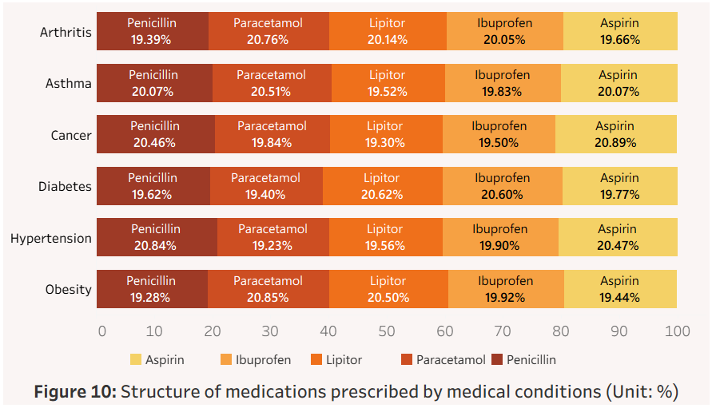
</p>

> ***Initial observation:*** 
>- Regarding the most commonly prescribed medications for each condition: the distributions were **fairly** even across medications for most conditions, with no single medication overwhelmingly dominant. Each condition had five top medications according to the dataset, and the percentage of patients using each was quite balanced, typically around **19–21%.**

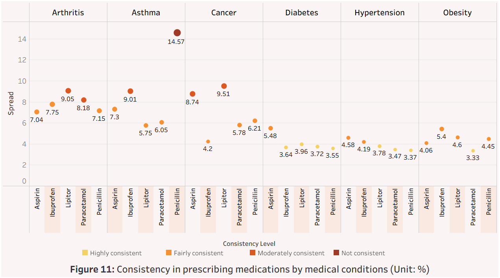

> ***Initial observation:*** 
>- Regarding the **variation (spread)** in prescription percentages between hospitals for each condition: the results showed that **Diabetes and Hypertension** were the most uniform (**“Highly consistent”**) – the spread between hospitals was only about **3–4%**. **Cancer and Obesity** were **fairly consistent** with spreads around **4–6%**. **Arthritis** was **moderately consistent** with spreads of **7–9%**. **Asthma** was the least consistent (**“Not consistent”**), especially for the drug **Penicillin** (spread up to **14.6%**).

### 4.7. Analysis of admission types
The SQL queries applied `GROUP BY` by medical condition and admission type; use `AVG` and `COUNT` to compute lengths of stay and costs; arithmetic to normalize cost per day; and `ORDER BY` to find the groups with the highest case counts and costs.

***Answering*:** *How are patients admitted — mostly through emergency, urgent, or planned admissions — and how does admission type impact length of stay and treatment costs?*

``` sql
-- Impact of Admission Type on length of stay & treatment costs
SELECT  
    medical_condition, 
    admission_type, 
    COUNT(*) AS total_cases, 
    ROUND(AVG(CAST(length_of_stay AS FLOAT)), 2) AS avg_length_of_stay, 
    CAST(AVG(billing_amount) AS DECIMAL(10,2)) AS avg_total_cost, 
    CAST(AVG(cost_per_day) AS DECIMAL(10,2)) AS avg_cost_per_day 
FROM v_healthcare_analysis 
GROUP BY medical_condition, admission_type 
ORDER BY medical_condition, total_cases DESC;
```

<p align="center">
  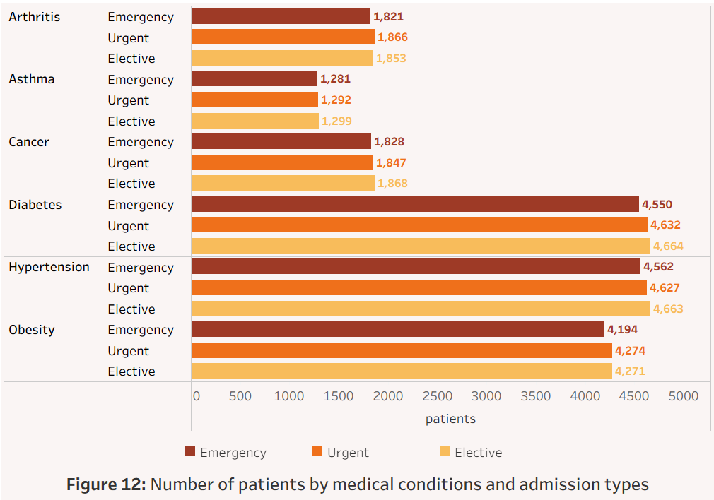
</p>

> ***Initial observation:***
>- Regarding the most common admission methods, in general patients were more often admitted via **Elective (planned) or Urgent** admissions **than Emergency**, and this distribution was quite uniform across admission types for most conditions. 
>- For chronic, common conditions such as **Diabetes, Hypertension, and Obesity**, patient admissions were distributed almost evenly across the three types. 
>- For less common conditions (**Arthritis, Asthma, Cancer**), patient counts were also very evenly distributed among the three admission types, with each type having between roughly **1,280 and 1,870 cases.**

<p align="center">
  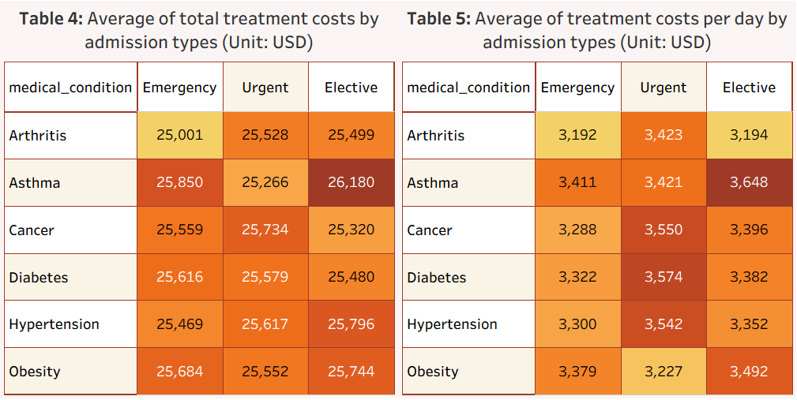
</p>

> ***Initial observation:***
>- Admission type affected costs, with a **clear distinction** between average total cost and average cost per day. 
>- **Impact on average total cost:** Differences between admission types were **not large**, with overall averages around **\$25,000–\$26,000.** **Elective (planned)** admissions had the **highest total costs**. For most conditions, **Elective** cases had the **highest** average total cost. 
>- **Impact on average cost per day:** **Urgent** admissions had the **highest** per-day costs. For most conditions (except Asthma and Obesity), **Urgent** admissions had the highest average cost per day. **Asthma** was an exception: it had the highest cost per day under **Elective** admissions (notably **$3,648 per day** for Asthma under Elective).

### 4.8. Analysis of insurance providers
The SQL queries used `GROUP BY` by insurance provider; `AVG`, `MIN`, `MAX`, `COUNT` to describe costs; a `CTE` to normalize data; `CASE WHEN` to calculate test result percentages; and `ORDER BY` to rank by size.

***Answering:***  *Which insurance companies cover the most patients, and how does this relate to treatment costs and patient outcomes?*
``` sql
-- Top insurance providers by patient count and avg cost
SELECT  
    insurance_provider, 
    COUNT(*) AS total_patients, 
    ROUND(AVG(billing_amount), 2) AS avg_bill, 
    ROUND(MIN(billing_amount), 2) AS min_cost, 
    ROUND(MAX(billing_amount), 2) AS max_cost 
FROM v_healthcare_analysis 
GROUP BY insurance_provider 
ORDER BY total_patients DESC;

-- Insurance provider vs test results & avg LOS
;WITH insurance_summary AS (
    SELECT  
        insurance_provider, 
        COUNT(*) AS total_patients, 
        CAST((100.0 * COUNT(*) / SUM(COUNT(*)) OVER ()) AS decimal(5,2)) AS pct_by_patients, 
        ROUND(AVG(billing_amount), 2) AS avg_bill, 
        ROUND(AVG(CAST(length_of_stay AS FLOAT)), 2) AS avg_length_of_stay, 
        CAST(100.0 * SUM(CASE WHEN test_results = 'Abnormal' THEN 1 ELSE 0 END) / COUNT(*) AS decimal(5,2)) AS pct_abnormal_results, 
        CAST(100.0 * SUM(CASE WHEN test_results = 'Normal' THEN 1 ELSE 0 END) / COUNT(*) AS decimal(5,2)) AS pct_normal_results, 
        CAST(100.0 * SUM(CASE WHEN test_results = 'Inconclusive' THEN 1 ELSE 0 END) / COUNT(*) AS decimal(5,2)) AS pct_inconclusive_results 
    FROM v_healthcare_analysis 
    GROUP BY insurance_provider 
) 
SELECT * 
FROM insurance_summary 
ORDER BY total_patients DESC;
```
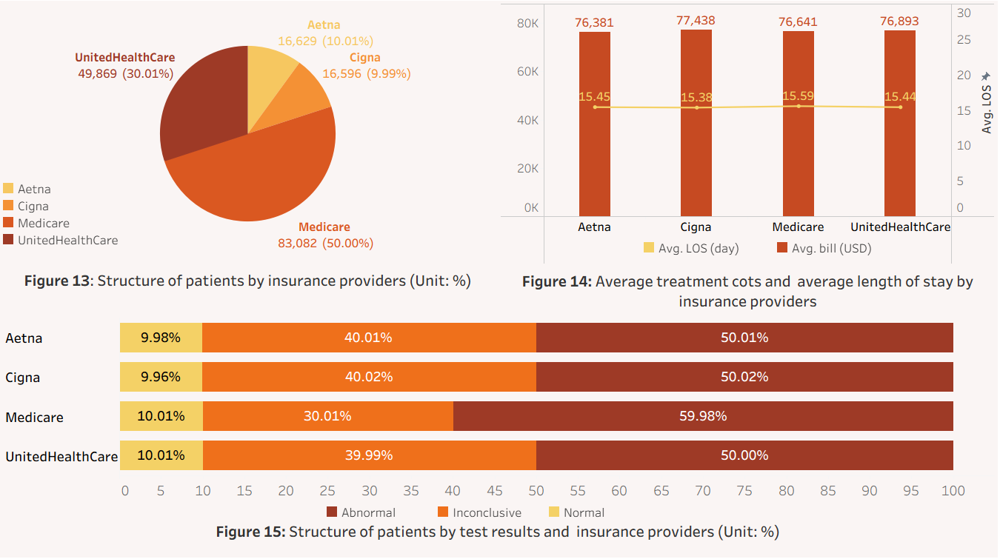

> ***Initial observation:*** 
>- **Medicare** had the largest number of patients (**50%**), the highest share in the dataset. It was followed by **UnitedHealthCare** (30%), **Aetna** (10%), and **Cigna** (10%). This indicated **Medicare** was the clearly **dominant** insurer in this data.
>- **Average treatment costs** varied only slightly across insurers, around **\$25,400–\$25,800**. **Cigna** had the **highest** average cost (\$25,812) and **Aetna** the **lowest** (\$25,460). However, note that billing_amount reflects total treatment cost and does not distinguish between the portion paid by insurance and the portion paid by patients. Therefore, cost differences between insurers only reflect the profile of the patients they cover, not the actual payments made by each insurer.
>- **Average length of stay** was relatively stable (**about 15.4–15.6 days**), with no significant differences among insurers. The rate of **abnormal** test results was **highest** for **Medicare (59.98%)**, while the other insurers were **around 50%**.

### 4.9. Analysis of geographic distribution (hospital locations)
The SQL queries used `GROUP BY` by hospital name and coordinates; `COUNT` and `SUM` to aggregate patient volumes and billing; and arithmetic functions with `ROUND` to prepare data for spatial analysis.

***Answering***:  *Where are the hospitals located, and are there regional differences in patient health profiles, quality of care, or billing amounts?*
``` sql
-- Geographical analysis (hospital locations) 
SELECT 
    hospital, hospital_latitude, hospital_longitude, 
    COUNT(*) AS patients, 
    ROUND(SUM(billing_amount), 2) AS total_bill 
FROM v_healthcare_analysis 
GROUP BY hospital, hospital_latitude, hospital_longitude;
```
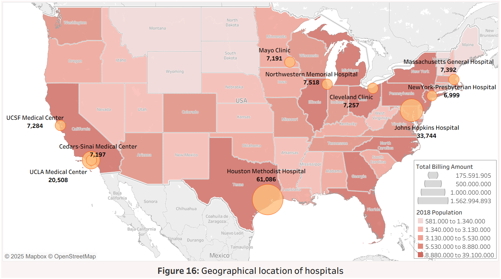

> ***Initial observation:*** 
>
> The map above showed the 10 largest hospitals in the U.S., distributed across the **Northeast, Midwest, South, and West** regions. The regional distribution is as follows:
>- **Northeast:** The Northeast region hosted many large hospitals such as Johns Hopkins Hospital, ***NewYork-Presbyterian Hospital, and Massachusetts General Hospital***. This region had a high population density and correspondingly recorded the largest total treatment costs and patient volumes.
>- **Midwest:** The Midwest included ***Mayo Clinic, Cleveland Clinic, and Northwestern Memorial Hospital.*** These hospitals were relatively close together, serving a concentrated population but on a smaller scale than the Northeast centers.
>- **Southern U.S.:** The Southern U.S., highlighted by ***Houston Methodist Hospital***, showed the largest treatment scale on the map. Houston had the highest total billing (treatment costs) and also the highest patient count among the group (61,086 patients).
>- **Western U.S.:** The West included ***UCLA Medical Center, Cedars-Sinai Medical Center, and UCSF Medical Center*** in California. This was a densely populated region with relatively high total treatment costs, but on a smaller scale than Houston or Johns Hopkins.
>
> **Size differences between regions:** Hospitals in **Texas** and the **Northeast** had significantly **higher** total treatment costs. The **West** and **Midwest** had many hospitals, but their combined costs and patient volumes tended to be **lower**.
>
> **Density and distances:** Hospitals in the **Northeast** and **Midwest** were geographically **close**, creating a high density of healthcare facilities. In contrast, the **West** and **South** had **greater** distances between major medical centers, resulting in a wider service area per hospital. The large scale in these regions (especially **Houston Methodist Hospital**) reflected their broader coverage areas and lower hospital density.

## 5. Key Insights

>	***Overall conclusions on patient demographics:*** 
>- The most common patient group was adults aged **18–44** (39%), followed by those aged **45–64** (30%). **Females** accounted for the **highest** share of patients (50%), about 10 percentage points more than males. By blood type, **A+** (35%) and **O+** (25%) were the most prevalent. Considering all three factors, **young women (18–44) with blood type A+** formed the single **largest** group (nearly 8% of cases). 
>- In general, certain patient groups — especially **younger women with blood type A+ or O+** — had significantly **higher** hospitalization rates than others, reflecting demographic and physiological influences on disease prevalence and healthcare needs.

>***Overall conclusions on medical conditions:*** 
>- The most common conditions were **Hypertension** (25%), **Diabetes** (25%), and **Obesity** (23%). The primary affected age groups were **18–44** (~39%) and **45–64** (~30%), and **females** were the most affected (notably for Asthma, Arthritis, and Cancer). The most common blood types were **A+** (most prevalent in Asthma, Hypertension, and Cancer) and **O+** (most prevalent in Diabetes). 
>- The highest overall risk group was **females aged 18–44 with blood type A+**. Notably, for Diabetes specifically, the highest-risk group was **males aged 18–44 with blood type O+.**

>***Overall conclusions on length of stay:*** 
>- The **average length of stay** was about **15–16 days** for almost all conditions. **Hypertension** had the **highest** average LOS (15.63 days) and Asthma the lowest (15.39 days). However, this duration varied only slightly by admission type and by hospital (differences were on the order of **±1.5 days** between hospitals). 
>- **Emergency** admissions had slightly longer stays on average than Elective or Urgent admissions. Overall, length of stay was fairly **uniform** across conditions, hospitals, and admission types, reflecting standardized care processes.

>***Overall conclusions on treatment costs:*** 
>- **Average treatment costs** for the common conditions were around **\$25,500**. 
>- However, there were **differences** between hospitals, especially for **Asthma**. Some hospitals had costs about **\$1,000–\$2,000** **higher** than the overall average.

>***Overall conclusions on patient volumes and outcomes:*** 
>- **Large** hospitals like **Houston Methodist, Johns Hopkins, and UCLA Medical Center** treated the most patients and also have similar distributions of test results. 
>- **NewYork-Presbyterian** stood out with the **highest** rate of **“Normal”** test results.

>***Overall conclusions on admission types:*** 
>- **No single admission** type dominates; patient admissions were split **roughly** **equally** among Emergency, Urgent, and Elective across the conditions. In most cases, the number of cases was nearly the same for each type, although for chronic conditions (**Hypertension, Diabetes, Obesity**), **Elective and Urgent** admissions were **slightly** more common than **Emergency**. 
>- Admission type had the greatest impact on treatment costs, especially **per-day** costs: **Elective and Urgent** admissions tended to be a bit more **expensive**.

>***Overall conclusions on insurance providers:*** 
>- Although **Medicare** had the **largest** patient count and the highest abnormal result rate, the average costs and lengths of stay were **quite similar across** insurers. 
*(Since the data only showed total billing (not how much insurers actually paid), we cannot conclude which insurer “pays more” or is more “efficient”; we can only say that the average cost recorded per patient is about the same for each insurance company.)*

>***Overall conclusions on geographic distribution:*** 
>- The distribution of top hospitals was uneven nationwide. Medical centers in densely populated regions (**Northeast, South, and West**) had **higher** patient counts and total treatment costs, whereas the **Midwest** had a high density of hospitals but a smaller scale of patients and costs per hospital.


